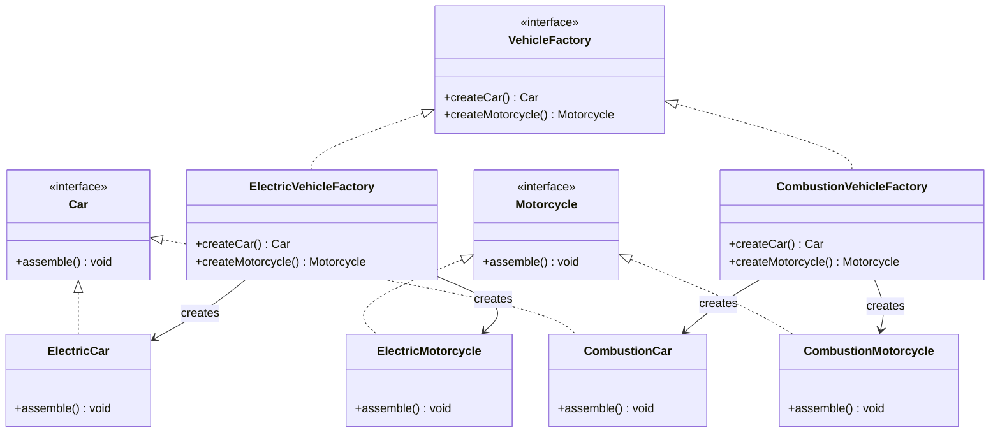

# Tafera Padrões de Projetos
## Abstract Factry

```mermaid
classDiagram
    class Car {
        <<interface>>
        +assemble() void
    }

    class Motorcycle {
        <<interface>>
        +assemble() void
    }

    class ElectricCar {
        +assemble() void
    }

    class ElectricMotorcycle {
        +assemble() void
    }

    class CombustionCar {
        +assemble() void
    }

    class CombustionMotorcycle {
        +assemble() void
    }

    class VehicleFactory {
        <<interface>>
        +createCar() Car
        +createMotorcycle() Motorcycle
    }

    class ElectricVehicleFactory {
        +createCar() Car
        +createMotorcycle() Motorcycle
    }

    class CombustionVehicleFactory {
        +createCar() Car
        +createMotorcycle() Motorcycle
    }

    Car <|.. ElectricCar
    Car <|.. CombustionCar
    Motorcycle <|.. ElectricMotorcycle
    Motorcycle <|.. CombustionMotorcycle
    VehicleFactory <|.. ElectricVehicleFactory
    VehicleFactory <|.. CombustionVehicleFactory
    ElectricVehicleFactory --> ElectricCar : creates
    ElectricVehicleFactory --> ElectricMotorcycle : creates
    CombustionVehicleFactory --> CombustionCar : creates
    CombustionVehicleFactory --> CombustionMotorcycle : creates
```
