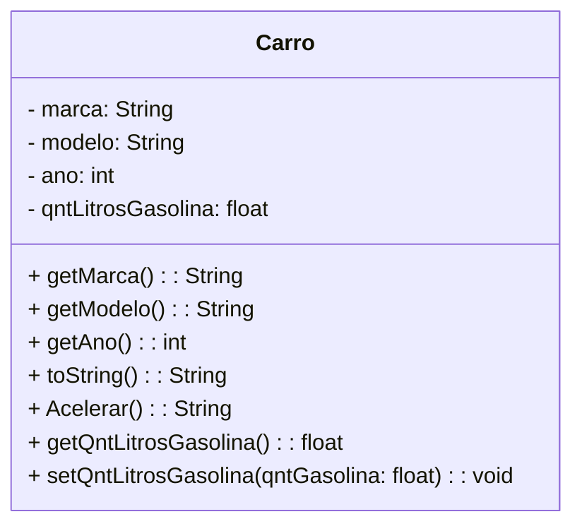

# Diagramação UML 

# Implementação

## Carro.java

```
public class Carro {
    private final String marca;
    private final String modelo;
    private final int ano;
    private float qntLitrosGasolina;

    // Construtor
    public Carro(String marca, String modelo, int ano) {
        this.marca = marca;
        this.modelo = modelo;
        this.ano = ano;
    }

    // Métodos getters e setters
    public String getMarca() {
        return marca;
    }

    public String getModelo() {
        return modelo;
    }

    public int getAno() {
        return ano;
    }

    // Método toString para exibir informações do carro
    @Override
    public String toString() {
        return "Carro{" +
                "marca='" + marca + '\'' +
                ", modelo='" + modelo + '\'' +
                ", ano=" + ano +
                '}';
    }

    public String Acelerar(){        
        ConsumirGasolina();
        return "Vrummmm!!";
    }

    private void ConsumirGasolina(){
        this.qntLitrosGasolina--;
    }

    public float getQntLitrosGasolina() {
        return qntLitrosGasolina;
    }

    public void setQntLitrosGasolina(float qntGasolina) {
        this.qntLitrosGasolina = qntGasolina;
    }
}


```

## Main.java

```
public class Main {
    public static void main(String[] args) {
       Carro car =  new Carro("Hyundai","HB20S",2020);
       car.setQntLitrosGasolina(50);
       System.out.printf("-==   Dados do carro   ==- \n %s\n com %.2f L de gasolina", car.toString(), car.getQntLitrosGasolina());
       System.out.printf("\nAcelerar! %s", car.Acelerar());
       System.out.printf("\nCombustivel após a brincadeira: %.2f L", car.getQntLitrosGasolina());
    }
}

```
