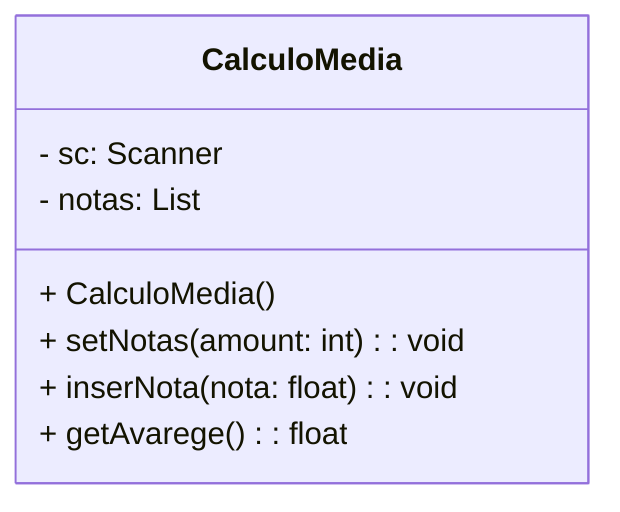

# Diagramação



# Implementação

## Main.java

```

public class Main {
    public static void main(String[] args) {
        CalculoMedia gradesCalc = new CalculoMedia();
        gradesCalc.setNotas(4);
        float avarege = gradesCalc.getAvarege();
        System.out.printf("A média do aluno é: %.2f\n", avarege);
        if(avarege >= 7){
            System.out.println("Aluno Aprovado!");
        }else if(avarege >=5){
             System.out.println("Aluno em Recuperação!");
        }else{
            System.out.println("Aluno em Reprovado!");
        }
     }
}
```

## CalculoMedia.java

```
import java.util.ArrayList;
import java.util.List;
import java.util.Scanner;

public class CalculoMedia {
    Scanner sc;
    List<Float> notas;

    public CalculoMedia(){
        this.notas = new ArrayList<Float>();
        this.sc = new Scanner(System.in);
    }


    /**
     * @param amount: quantidade de notas a serem lidas
     */
    public void setNotas(int amount){        
        if(amount <= 0){ return;}
        notas.clear();
        for (int i = 0; i < amount; i++) {            
            System.out.printf("Digite a %d nota:", i+1);
            float grade = sc.nextFloat();
            notas.add(grade);
        }        
    }

    public void inserNota(float nota){        
        notas.add(nota);      
    }

    public float getAvarege(){
        float sum = 0;
        for(float grade: notas){
            sum += grade;
        }
        return sum/notas.size();
    }
}
```
