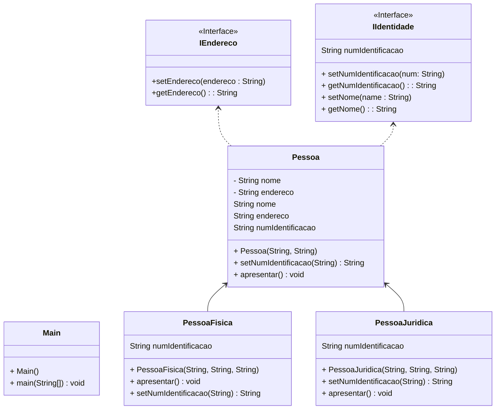

# 13 - Interfaces, Heranças, Composição e agregação

```mermaid
classDiagram
direction BT

class IEndereco {
<<Interface>>
+setEndereco(endereco : String)
+getEndereco() : String
}

class IIdentidade {
<<Interface>>
+ setNumIdentificacao(num: String) 
+ getNumIdentificacao() : String
+ setNome(name : String)
+ getNome() : String
  String numIdentificacao
  }

  class Main {
+ Main()
+ main(String[]) void
  }

  class Pessoa {
+ Pessoa(String, String)
- String nome
- String endereco
+ setNumIdentificacao(String) String
+ apresentar() void
  String nome
  String endereco
  String numIdentificacao
  }
  class PessoaFisica {
+ PessoaFisica(String, String, String)
+ apresentar() void
+ setNumIdentificacao(String) String
  String numIdentificacao
  }
  class PessoaJuridica {
+ PessoaJuridica(String, String, String)
+ setNumIdentificacao(String) String
+ apresentar() void
  String numIdentificacao
  }

Pessoa  ..>  IEndereco
Pessoa  ..>  IIdentidade
PessoaFisica  -->  Pessoa
PessoaJuridica  -->  Pessoa 

```
