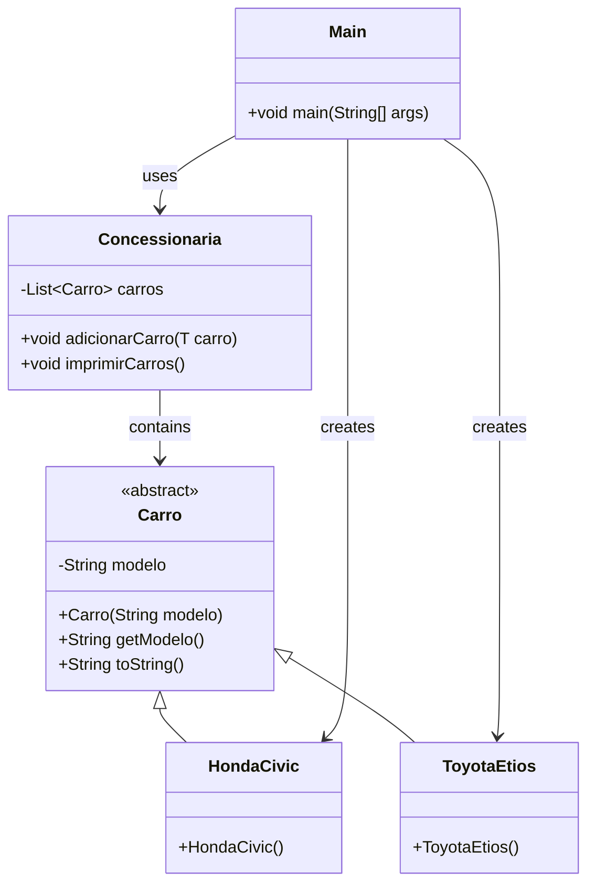

# Tarefa Generics

```mermaid
classDiagram
    class Carro {
        <<abstract>>
        -String modelo
        +Carro(String modelo)
        +String getModelo()
        +String toString()
    }

    class HondaCivic {
        +HondaCivic()
    }

    class ToyotaEtios {
        +ToyotaEtios()
    }

    class Concessionaria {
        -List~Carro~ carros
        +void adicionarCarro(T carro)
        +void imprimirCarros()
    }

    class Main {
        +void main(String[] args)
    }

    Carro <|-- HondaCivic
    Carro <|-- ToyotaEtios
    Concessionaria --> Carro : contains
    Main --> Concessionaria : uses
    Main --> HondaCivic : creates
    Main --> ToyotaEtios : creates
```